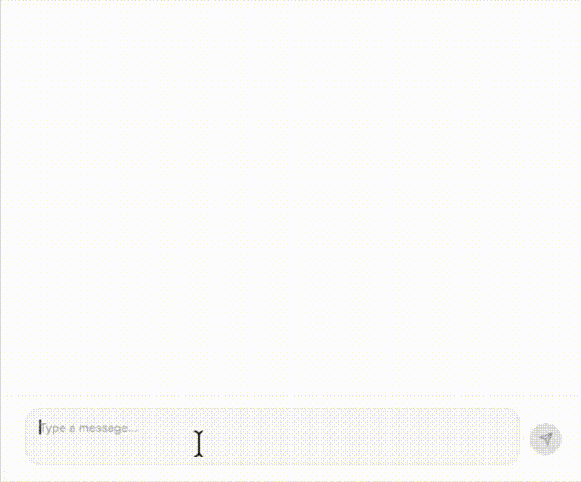
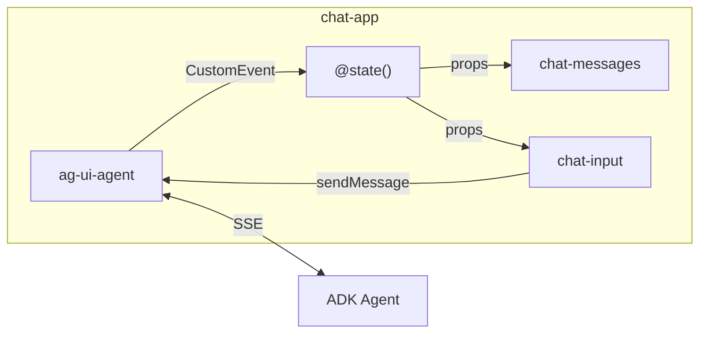

# adk-ag-ui-lit-sample

Sample application demonstrating [AG-UI protocol](https://docs.ag-ui.com/) integration with Google ADK (Agent Development Kit) backend and Lit web components frontend.



## Features

Implemented and planned features

- [x] Text message streaming
- [ ] Tool rendering
- [ ] Frontend tool calls
- [ ] State synchronization
- [ ] Interrupts (Human-in-the-loop)
- [ ] User authentication and sessions
- [ ] Multimodality

## Prerequisites

- Python 3.13+ with [uv](https://docs.astral.sh/uv/)
- Node.js with [pnpm](https://pnpm.io/)
- Gemini API key ([Google AI Studio](https://aistudio.google.com/apikey)) or Google Cloud project with Vertex AI

## Quick Start

### 1. Start the Agent (Backend)

```bash
cd agent
uv sync

# Option A: Google AI Studio (Gemini API)
export GOOGLE_API_KEY=<your-api-key>

# Option B: Vertex AI
export GOOGLE_GENAI_USE_VERTEXAI=1
export GOOGLE_CLOUD_PROJECT=<your-project-id>
export GOOGLE_CLOUD_LOCATION=global

uv run python main.py
```

The agent server starts on http://localhost:8000

### 2. Start the Web Frontend

```bash
cd web
pnpm install
pnpm dev
```

The dev server starts on http://localhost:5173 with hot reload.

## Architecture

```
├── agent/ # Python backend - Google ADK agent with AG-UI middleware
└── web/   # TypeScript frontend - Lit web components with Vite
```

### Frontend

The frontend follows the **["properties down, events up"](https://lit.dev/docs/composition/component-composition/#when-to-use-properties-events-or-slots)** pattern from Lit/Web Components conventions. Data flows down via properties, while state changes propagate up via CustomEvents.

`<ag-ui-agent>` is a headless Custom Element that handles AG-UI protocol communication and dispatches events upward. `<chat-app>` acts as a [mediator](https://lit.dev/docs/composition/component-composition/#mediator-pattern) that listens to these events, updates its internal state, and passes data down to sibling components as properties.



## Tech Stack

**Backend:**
- [Google ADK](https://google.github.io/adk-docs/) with Gemini 2.5 Flash
- [ag-ui-adk](https://pypi.org/project/ag-ui-adk/) - AG-UI protocol middleware
- FastAPI + Uvicorn

**Frontend:**
- [Lit](https://lit.dev/) - Web components
- [@ag-ui/client](https://www.npmjs.com/package/@ag-ui/client) - AG-UI client library
- TypeScript + Vite

## License

Apache 2.0
